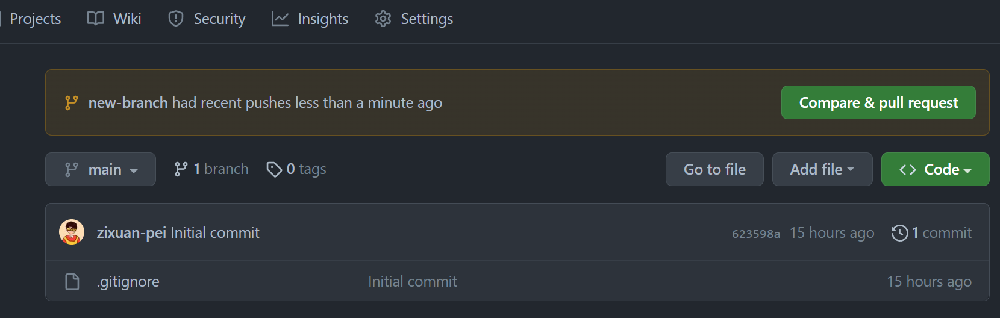
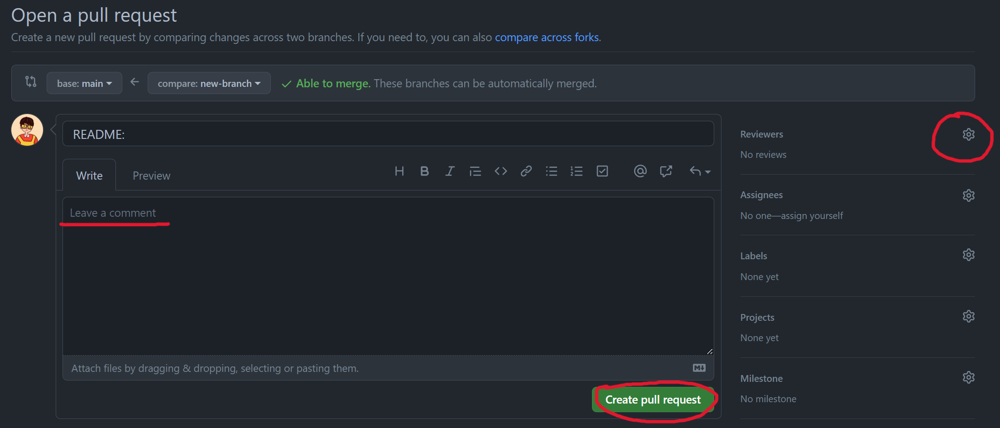
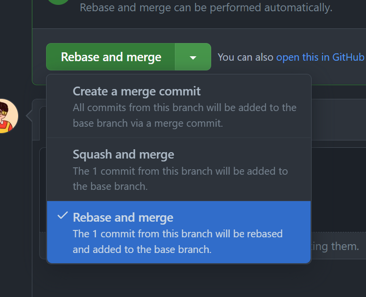

# CPEN 321 Project

## Getting Started With GitHub

### Branch

Please create a new branch for each feature. When finishing developing a feature, you need to open up a Pull Request. Before merging to main, you can add reviewers for code review. After all this, please select Rebase and Merge option to merge into main.

#### **How to create a branch and open up a PR?**

1. If you have not yet cloned the repo to your local machine, do it:

   1) `git clone https://github.com/zixuan-pei/we-need-a-name <local_repo_name>` 
   2) `cd <local_repo_name>`

2. Create a PR branch:

   ```bash
   $ git checkout -b new-branch
   Switched to a new branch 'new-branch'
   ```

3. Push the branch to GitHub:

   ```bash
   $ git push origin --set-upstream new-branch
   Total 0 (delta 0), reused 0 (delta 0), pack-reused 0
   remote:
   remote: Create a pull request for 'new-branch' on GitHub by visiting:
   remote:      https://github.com/zixuan-pei/we-need-a-name/pull/new/new-branch
   remote:
   To https://github.com/zixuan-pei/we-need-a-name
   * [new branch]      new-branch -> new-branch
   Branch 'new-branch' set up to track remote branch 'new-branch' from 'origin'.
   ```

4. Commit changes on your local repo on the new branch.

5. Push your changes up to your branch:

   ```bash
   $ git push 
   Enumerating objects: 4, done.
   Counting objects: 100% (4/4), done.
   Delta compression using up to 16 threads
   Compressing objects: 100% (3/3), done.
   Writing objects: 100% (3/3), 1.43 KiB | 1.43 MiB/s, done.
   Total 3 (delta 0), reused 0 (delta 0), pack-reused 0
   To https://github.com/zixuan-pei/we-need-a-name
   623598a..0005adb  new-branch -> new-branch
   ```

6. Create the PR

   1) Option 1: Use the URL given when you created the branch above (step 4). In this case it would just be putting `https://github.com/zixuan-pei/we-need-a-name/pull/new/new-branch` into your browser.
   2) Option 2: Go to the website for the repo (https://github.com/zixuan-pei/we-need-a-name) and look for the newly-populated button allowing you to create a PR:

        

        Click it!

7. Now you can assign reviewers, add a comment to the PR, and create it:

    

8. When everything is done and you're ready to merge the branch into main, choose Rebase and Merge option:

    

### Multiple commits in a Pull Request

To make commit history clean, please reset Git base before add new commits to a PR:

1. On GitHub, switch to your branch.
2. Click Commits and find the latest commit that is not from your branch (which is the latest commit when you create your branch).
3. Copy the commit SHA.
4. Reset base to that commit:

    ```git reset --soft <SHA>```
5. Add changed files and commit new changes.
6. Finally, push the updated changes to the PR:

    ```git push --force```

## Continous Delivery

`pm2` is used to run the server. Here are some useful commands:

1. To list all running applications:

   `pm2 ls`

2. To start the server (you don't really need this unless there's no running applications):

   `pm2 start --name <App Name> server.js`

3. Delete a running application:

   `pm2 delete <App Name>`

4. Restart an application (run it when the server has error or the code is changed):

   `pm2 restart <App Name>`

5. To monitor logs, custom metrics, application information:

   `pm2 monit`

The server has a `/deploy` endpoint. Whenever there is a POST request sent to `/deploy`, the server will fetch the latest Git commit and restart itself using `pm2 restart <App Name>`.

A GitHub Webhook is set to send a POST request to the `/deploy` endpoint upon new commits. You can find the webhooks in Settings -> Webhooks.

